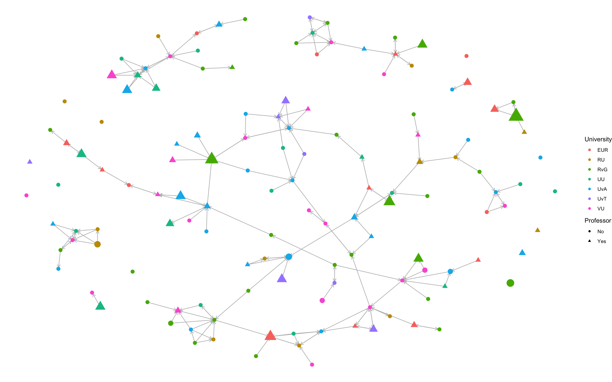

```{r, echo=FALSE}
library(foreign)
library(tidyverse)
library(scholar) 
library(openalexR)
library(rvest) 
library(jsonlite)
library(RSiena)

```

```{r, echo=FALSE}
fpackage.check = function(packages) {
    lapply(packages, FUN = function(x) {
        if (!require(x, character.only = TRUE)) {
            install.packages(x, dependencies = TRUE)
            library(x, character.only = TRUE)
        }
    })
}

fsave = function(x, file = NULL, location = "./data/processed/") {
    ifelse(!dir.exists("data"), dir.create("data"), FALSE)
    ifelse(!dir.exists("data/processed"), dir.create("data/processed"), FALSE)
    if (is.null(file))
        file = deparse(substitute(x))
    datename = substr(gsub("[:-]", "", Sys.time()), 1, 8)
    totalname = paste(location, datename, file, ".rda", sep = "")
    save(x, file = totalname)  #need to fix if file is reloaded as input name, not as x. 
}

fload = function(filename) {
    load(filename)
    get(ls()[ls() != "filename"])
}

fshowdf = function(x, ...) {
    knitr::kable(x, digits = 2, "html", ...) |>
        kableExtra::kable_styling(bootstrap_options = c("striped", "hover")) |>
        kableExtra::scroll_box(width = "100%", height = "300px")
}

```

```{r, echo=FALSE}

fcolnet = function(data = scholars, university = c("RU", 'UU'), discipline = "Sociologie", waves = list(c(2015, 2018), c(2019, 2023), c(2024, 2025)), type = c("first")) {

    university = paste0('(', paste0(university, collapse='|' ), ')')
    discipline = paste0('(', paste0(discipline, collapse='|' ), ')')

    # step 1
    demographics = data$demographics
    sample = which(
        (str_detect(demographics$universiteit.22, university)
            | str_detect(demographics$universiteit.24, university)
            | str_detect(demographics$universiteit.25, university)
        ) & (
            str_detect(demographics$discipline.22, discipline)
            | str_detect(demographics$discipline.24, discipline)
            | str_detect(demographics$discipline.25, discipline)
        ) |> replace_na(FALSE))

    demographics_soc = demographics[sample, ] |> drop_na(id)

    # step 2
    ids = demographics_soc$id |> unique()


    scholars_sel = list() 
    for (id_ in ids){
        scholars_sel[[id_]] = bind_rows(scholars$works) |>
            filter(author_id == id_)
    }
    scholars_sel = bind_rows(scholars$works) 
    

    nwaves = length(waves)
    nets = array(0, dim = c(nwaves, length(ids), length(ids)), dimnames = list(wave = 1:nwaves, ids,
        ids))
    dimnames(nets)

    # step 3
    df_works = tibble(
            works_id = scholars_sel$id, 
            works_author = scholars_sel$authorships, 
            works_year = scholars_sel$publication_year
        )


    df_works = df_works[!duplicated(df_works), ]

    # step 4
    if (type == "first") {
        for (j in 1:length(waves)) {
            df_works_w = df_works[df_works$works_year >= waves[[j]][1] & df_works$works_year <= waves[[j]][2],
                ]
            for (i in 1:nrow(df_works_w)) {
                ego = df_works_w$works_author[i][[1]]$id[1]
                alters = df_works_w$works_author[i][[1]]$id[-1]
                if (sum(ids %in% ego) > 0 & sum(ids %in% alters) > 0) {
                  nets[j, which(ids %in% ego), which(ids %in% alters)] = 1
                }
            }
        }
    }

    if (type == "last") {
        for (j in 1:length(waves)) {
            df_works_w = df_works[df_works$works_year >= waves[[j]][1] & df_works$works_year <= waves[[j]][2],
                ]
            for (i in 1:nrow(df_works_w)) {
                ego = rev(df_works_w$works_author[i][[1]]$id[1])
                alters = rev(df_works_w$works_author[i][[1]]$id[-1])
                if (sum(ids %in% ego) > 0 & sum(ids %in% alters) > 0) {
                  nets[j, which(ids %in% ego), which(ids %in% alters)] = 1
                }
            }
        }
    }
    if (type == "all") {
        for (j in 1:length(waves)) {
            df_works_w = df_works[df_works$works_year >= waves[[j]][1] & df_works$works_year <= waves[[j]][2],
                ]
            for (i in 1:nrow(df_works_w)) {
                egos = df_works_w$works_author[i][[1]]$id
                if (sum(ids %in% egos) > 0) {
                  nets[j, which(ids %in% egos), which(ids %in% egos)] = 1
                }
            }
            diag(nets[j,,]) = 0
        }
    }

    output = list()
    output$data = demographics_soc
    output$nets = nets
    return(output)
}
```


```{r, echo=FALSE}
packages = c(
    "RSiena", "tidyverse",
    'dplyr', 'stringr' # these packages were added to make the code run
)
fpackage.check(packages)

library(RSiena)
library(tidyverse)
library(dplyr)
library(stringr)

scholars = fload('data/processed/20251017scholars.Rda')

scholars$demographics = scholars$demographics |>
  mutate(
    universiteit.22 = str_replace(universiteit.22, 'RUG', 'RvG'),
    universiteit.24 = str_replace(universiteit.24, 'RUG', 'RvG'),
    universiteit.25 = str_replace(universiteit.25, 'RUG', 'RvG'),
  )
```

# Descriptive statistics

## Difference in prestige between departments

```{r}
# Frequency table for mean h-index per department

Dep_value <- c('EUR', 'RU', 'RvG', 'UU', 'UvA', 'UvT', 'VU')
Dep_count <- c(14.78125, 15.50000, 24.70968, 16.68000, 16.67647, 15.37500, 20.00000)
df_freq_Dep <- data.frame(Department = Dep_value, Mean_prestige = Dep_count)
fshowdf(df_freq_Dep)

```


## Indegree distribution

If I assume the principle of preferential attachment, I expect that most sociologists in the dataset have a low indegree distribution, and a few have a very high indegree distribution.

```{r}

library(ggplot2)

InD_value <- c(0, 1, 2, 3, 4, 5, 6, 7, 8)
InD_count <- c(288, 80, 41, 17, 10, 6, 7, 3, 2)
df_freq_InD <- data.frame(Number_of_ties = InD_value, Count = InD_count)

with(df_freq_InD, hist(rep(x = InD_value, times = InD_count)))

```
As seen in the histogram above, the principle of preferential attachment is applicable in this sample, as an overwhelming majority of the sociologists have an indegree of 0, and only a few have 1 or more. 

## Jaccard Similarity Index

To assess whether the waves are too similar, meaning indiscernible changes in the comparison of those two waves, I am calculating the Jaccard Similarity Index. It is a number between 0 and 1, with 0 indicating no similarity and 1 complete similarity. 

```{r, eval=FALSE}
funjacc <- function(wave1, wave2) {
  
  diag(wave1) <- NA
  diag(wave2) <- NA
  tablejacc <- table(as.numeric(wave1), as.numeric(wave2)) 
  jaccard <- tablejacc[2,2] /(tablejacc[1,2] + tablejacc[2,1] + tablejacc[2,2])
  hamming <- tablejacc[2,1] + tablejacc[1,2]
  
  return(jaccard)
  
}

funjacc(wave1, wave2)
```

The Jaccard similarity index is 0.1748634, which indicates that there is enough difference between the two waves that comparison yields discernible results.  

## Visualisations

```{r, eval=FALSE}

#Without isolates
#Wave 1
no_iso_w1 = rowSums(sociologists$nets[1,,]) > 0
net_no_iso_w1 = sociologists$nets[1,no_iso_w1,no_iso_w1]
df_no_iso_w1 = df_ego2[no_iso_w1, ]

# categorizing h-index for the visualization

df_no_iso_w1$h_index_cat <- df_no_iso_w1$h_index
df_no_iso_w1$h_index_cat <- ifelse(df_no_iso_w1$h_index_cat > 9, df_no_iso_w1$h_index_cat, 0)
df_no_iso_w1$h_index_cat <- as.character(df_no_iso_w1$h_index_cat)
df_no_iso_w1$h_index_cat <- substr(df_no_iso_w1$h_index_cat, start=1, stop=1)
table(df_no_iso_w1$h_index_cat, df_no_iso_w1$h_index)
df_no_iso_w1$h_index_cat <- as.numeric(df_no_iso_w1$h_index_cat)

# visualizations

University <- factor(df_no_iso_w1$university)
Professor <- as.factor(df_no_iso_w1$bigleague)
Professor <- ifelse(Professor == 1, 'Yes', 'No')

ggraph(net_no_iso_w1,
       layout = "fr") +
  geom_edge_link(arrow = arrow(length = unit(2, 'mm')), end_cap = circle(1, 'mm'), color = "gray", width = 0.5) +
  geom_node_point(size = 3 + df_no_iso_w1$h_index_cat, aes(color = University, shape = Professor)) + 
  scale_size(range = c(3, 10)) + 
  theme_void()

```


The different sociology departments are each represented by a different color. A triangle shape is an assistant professor, associate professor or a full professor, whereas a circle shape is any staff member who is not listed as a professor. The size of the node stands for the size of the personal h-index value.  

Professors are more likely to have a high h-index than non-professors. It appears h-index has little effect on forming stars in the network, but there is little to conclude regarding the hypotheses yet.


# RSiena Results

## RSiena objects

```{r, eval=FALSE}

df_ego2$uni_num <- as.numeric(df_ego2$uni_num)
uni_num2 <- coCovar(df_ego2$uni_num,centered=FALSE)

df_ego2$gender_num <- as.numeric(df_ego2$gender_num)
gender_dummy <- coCovar(df_ego2$gender_num, centered=FALSE)

H_index_CC <- coCovar(df_ego2$h_index, centered = TRUE)
mean_h_CC <- coCovar(df_ego2$mean_h, centered = TRUE)


#Making the data object

collab1 <- sienaDataCreate(net, uni_num2, gender_dummy, H_index_CC, mean_h_CC)

```

## Tables

### Table 1: Convergence and fit statistics

```{r}

#fshowdf: To print objects (tibbles / data.frame)
fshowdf <- function(x, ...) {
    knitr::kable(x, digits = 2, "html", ...) %>%
        kableExtra::kable_styling(bootstrap_options = c("striped", "hover")) %>%
        kableExtra::scroll_box(width = "100%", height = "300px")
}

# Table of convergence and fit statistics
table <- c("Target", "Model 0", "Model 1", "Model 2", "Model 3", "Model 4", "Model 5")
conv <- c('< 0.25', 0.0894, 0.3193, 0.2959, 0.2837, 0.3220, 0.1118)
indegreegof <- c('> 0.05', 0, 0.006, 0.005, 0.006, 0.038, 0.006)
outdegreegof <- c('> 0.05', 0, 0.009, 0.013, 0.011, 0.222, 0.241)
triadgof <- c('> 0.05', 0, 0.003, 0.003, 0.005, 0.02, 0.01)
convGOFdf <- data.frame(Model = table, Max.Conv = conv,
                        IndegreeGOF = indegreegof, OutdegreeGOF = outdegreegof,
                        TriadGOF = triadgof)
fshowdf(convGOFdf)

```

### Table 2: Structural variables

```{r, eval=FALSE}
#Combined table of results for structural variables
table2 <- c("Model 0", "Model 1", "Model 2", "Model 3", "Model 4", "Model 5")
densityEst <- c(-3.82, -3.78, -3.58, -3.72, -2.12, -1.97)
densitySe <- c(0.13, 0.13, 0.23, 0.44, 0.54, 0.75)
densityT <- c(-29.46, -29.21, -15.69, -8.54, -3.96, 2.63)
recipEst <- c(3.67, 2.44, 1.88, 2.46, 3.07, 3.03)
recipSe <- c(0.20, 0.20, 0.21, 0.25, 0.37, 0.31)
recipT <- c(17.99, 11.95, 9.11, 9.84, 8.40, 9.71)
transtrEst <- c(' ', 1.22, 0.98, 1.21, 1.71, 1.70)
transtrSe <- c(' ', 0.13, 0.14, 0.19, 0.19, 0.28)
transtrT <- c(' ', 9.51, 7.12, 6.51, 8.85, 5.96)
inpopEst <- c(' ', 0.20, 0.17, 0.19, 0.22, 0.20)
inpopSe <- c(' ', 0.03, 0.06, 0.13, 0.03, 0.06)
inpopT <- c(' ', 6.75, 2.79, 1.46, 7.05, 3.53)
outactEst <- c(' ', ' ', ' ',' ', -0.26, -0.27)
outactSe <- c(' ', ' ', ' ',' ', 0.09, 0.11)
outactT <- c(' ', ' ', ' ',' ', 2.77, -2.36)
inactEst <- c(' ', ' ', ' ',' ', 0.20, -0.56)
inactSe <- c(' ', ' ', ' ',' ', -2.77, 0.25)
inactT <- c(' ', ' ', ' ',' ', -1.98, -2.25)
isoEst <- c(' ', 4.59, 4.09, 4.64, 6.25, 6.50)
isoSe <- c(' ', 0.45, 0.68, 1.89, 0.79, 1.05)
isoT <- c(' ', 10.15, 5.99, 2.46, 7.96, 6.21)
strucResultdf <- data.frame(Model = table2, DensityEst = densityEst, DensitySE = densitySe, DensityT = densityT,
                          RecipEst = recipEst, RecipSE = recipSe, RecipT = recipT,
                          TransEst = transtrEst, TransSE = transtrSe, TransT = transtrT,
                          InpopEst = inpopEst, InpopSE = inpopSe, InpopT = inpopT,
                          OutactEst = outactEst, OutactSE = outactSe, OutactT = outactT,
                          InactEst = inactEst, InactSE = inactSe, InactT = inactT,
                          IsolEst = isoEst, IsolSE = isoSe, IsolT = isoT)

fshowdf(strucResultdf)

```

### Table 3: Covariate estimates, standard errors and t-statistics

```{r}
#Covariate estimates, standard errors and t-statistics
table3 <- c('Model 1', 'Model 2', 'Model 3', 'Model 4', 'Model 5')
hindexEst <- c(0.23, ' ', 0.22, 0.23, 0.24)
hindexSe <- c(0.12, ' ', 0.29, 0.18, 0.14)
hindexT <- c(1.92, ' ', 0.75, 1.23, 1.76)
meanhEst <- c(' ', -0.18, -0.19, -0.19, -0.21)
meanhSe <- c(' ', 0.17, 0.27, 0.21, 0.17)
meanhT <- c(' ', -1.04, -0.70, -0.91, -1.25)
genderEst <- c(' ', ' ', 0.00, 0.00, -0.00)
genderSe <- c(' ', ' ', 0.10, 0.11, 0.10)
genderT <- c(' ', ' ', 0.03, 0.01, -0.00)
uniEst <- c(' ', ' ', 0.28, 0.28, 0.27)
uniSe <- c(' ', ' ', 0.16, 0.15, 1.97)
uniT <- c(' ', ' ', 1.79, 1.89, 11.29)
covarResultdf <- data.frame(Model = table3, h_index_Est = hindexEst, h_index_Se = hindexSe, h_index_T = hindexT,
                          mean_h_index_Est = meanhEst, mean_h_index_Se = meanhSe, mean_h_index_T = meanhT,
                          gender_Est = genderEst, gender_Se = genderSe, gender_T = genderT,
                          university_Est = uniEst, university_Se = uniSe, university_T = uniT)

fshowdf(covarResultdf)

```

The results of the estimated models are documented in these tables. When discussing results per model, these tables act as the point of reference.

## Model 0

The null model acted as a benchmark for the later models. No main effects are added yet. 

```{r, eval=FALSE}

# Creating main algorithm
Main_algo <- sienaAlgorithmCreate()

# Specifying model 0
# Model 0: the null model, only density and reciprocity
effects0 <- getEffects(collab1)

#Estimating Model 0
Esti0 <- siena07(Main_algo, data = collab1, effects = effects1, returnDeps = TRUE)
Esti0

# Goodness of fit
model0gof1 <- sienaGOF(Esti0, IndegreeDistribution, verbose = FALSE, join = TRUE, varName = "net")
model0gof2 <- sienaGOF(Esti0, OutdegreeDistribution, verbose = FALSE, join = TRUE, varName = "net")
model0gof3 <- sienaGOF(Esti0, TriadCensus, verbose = FALSE, join = TRUE, varName = "net")
plot(model0gof1)
plot(model0gof2)
plot(model0gof3)

# t-value calculation
df_result0 <- cbind.data.frame(Esti0$theta,Esti1$se)
names(df_result0) <- c('theta','se')
df_result0$t_test <- df_result0$theta/df_result0$se

```
## Model 1

In Model 1, the null model was expanded upon by adding the individual h-index measure and the structural effects. The effect of prestige was added, and transitivity and reciprocity are taken into account. Transitivity is the formation of triangles between nodes and should be expected in every network analysis. When node A and node B have a tie, and node B and node C have a tie, it is likely that a tie forms between node A and node C. Reciprocity is the mechanism where the sender of a tie is also likely to receive a tie by the receiver node. Network isolates and indegree popularity are important to control for as well, as the isolates do not have ties, and it is necessary to check whether egos want to form ties with alters who simply have many ties, instead of alters who have a high level of individual prestige.

```{r, eval=FALSE}
# Model 1: ego level effect individual prestige 'h_index', structural effects 

effects1 <- getEffects(collab1)

# Included effects
  effects1 <- includeEffects(effects1, isolateNet, inPop, transTrip)
  effects1 <- includeEffects(effects1, higher, name = 'net', interaction1 = 'H_index_CC')

# effect of higher will be reversed in the interpretation  
  
# Estimating model 1
Esti1 <- siena07(Main_algo, data = collab1, effects = effects1, returnDeps=TRUE)
Esti1
  
# Goodness of fit
model1gof1 <- sienaGOF(Esti1, IndegreeDistribution, verbose = FALSE, join = TRUE, varName = "net")
model1gof2 <- sienaGOF(Esti1, OutdegreeDistribution, verbose = FALSE, join = TRUE, varName = "net")
model1gof3 <- sienaGOF(Esti1, TriadCensus, verbose = FALSE, join = TRUE, varName = "net")
plot(model1gof1)
plot(model1gof2)
plot(model1gof3)

# t-value calculation
df_result1 <- cbind.data.frame(Esti1$theta, Esti1$se)
names(df_result1) <- c('theta','se')
df_result1$ttest <- df_result1$theta/df_result1$se

```

From hypothesis 1, it would be expected that the theta-coefficient is negative, and that the t-value >= 2, which would mean that sociologists want to work together with someone with a higher h-index (p < 0.05). Because the effect of h-index is modeled as *higher* (Siena source), which states that ego has a higher value than the alter, the interpretation is reversed so a negative score means the ego has a lower value than the alter.  

As shown in Table 3, the effect of h-index is in the opposite direction than expected, as it is positive (t = 1.925), and it is not significant (p = 0.0596). It appears that there is no effect of individual prestige on the collaboration network. However, the poor Goodness of Fit indices of the model indicate poor fit when it comes to indegree distributions (0.006), outdegree distributions (0.009) and triad census (0.003), measured by the Mahalanobis distance. See Table 1 for these results. This means that the model does not match the observed data. If more effects are added, the Goodness of Fit may improve. 


## Model 2

A separate model, Model 2, was run with the mean value of the h-index per department instead of the individual h-index measure, as well as the same structural effects as in Model 1. 

```{r, eval=FALSE}

# Model 2: ego level effect departmental prestige 'mean_h', structural effects 

effects2 <- getEffects(collab1)

#Included effects
  effects2 <- includeEffects(effects2, isolateNet, inPop, transTrip)
  effects2 <- includeEffects(effects2, higher, name ='net', interaction1 = 'mean_h_CC')

# effect of higher will be reversed in the interpretation  
  
# Estimating model 2
Esti2 <- siena07(Main_algo, data = collab1, effects = effects2, returnDeps = TRUE)
Esti2
  
# Goodness of fit
model2gof1 <- sienaGOF(Esti2, IndegreeDistribution, verbose = FALSE, join = TRUE, varName = "net")
model2gof2 <- sienaGOF(Esti2, OutdegreeDistribution, verbose = FALSE, join = TRUE, varName = "net")
model2gof3 <- sienaGOF(Esti2, TriadCensus, verbose = FALSE, join = TRUE, varName = "net")
plot(model2gof1)
plot(model2gof2)
plot(model2gof3)

# t-value calculation
df_result2 <- cbind.data.frame(Esti2$theta, Esti2$se)
names(df_result2) <- c('theta','se')
df_result2$ttest <- df_result2$theta/df_result2$se


```
The convergence ratio has improved from Model 1 (0.319) to Model 2 (0.296). 

As shown in Table 3, the mean h-index per department is in the expected negative direction (-0.175), but also not significant (t = -1.038). It appears that there is no effect of departmental prestige on the collaboration network. The Goodness of Fit indices are close to identical to Model 1, also indicating poor fit from the indegree distributions (0.005), outdegree distributions (0.013) and triad census (0.003), measured by the Mahalanobis distance. See Table 1 for these results. This is likely due to the insignificance of both the individual h-index and the departmental mean h-index measures.   

## Model 3

Besides heterophily, homophily is also taken into account for the upcoming models. In line with Hypotheses 3a and 3b...

In Model 3, both ego-level measures for h-index, the individual and departmental prestige, were added, as well as the control variables university (numeric) and gender (dummy).

```{r, eval=FALSE}
# Adding both ego-level H-index measures, as well as the control variables

effects3 <- getEffects(collab1)

# Included effects
  effects3 <- includeEffects(effects3, isolateNet, inPop, transTrip)
  effects3 <- includeEffects(effects3, sameX, name ='net', interaction1 = 'gender_dummy')
  effects3 <- includeEffects(effects3, sameX, name ='net', interaction1 = 'uni_num2')
  effects3 <- includeEffects(effects3, higher, name ='net', interaction1 = 'H_index_CC')
  effects3 <- includeEffects(effects3, higher, name ='net', interaction1 = 'mean_h_CC')
  
# Estimating model 3
  Esti3 <- siena07(Main_algo, data = collab1, effects = effects3, returnDeps=TRUE)
  Esti3
  
# Goodness of fit
model3gof1 <- sienaGOF(Esti3, IndegreeDistribution, verbose = FALSE, join = TRUE, varName = "net")
model3gof2 <- sienaGOF(Esti3, OutdegreeDistribution, verbose = FALSE, join = TRUE, varName = "net")
model3gof3 <- sienaGOF(Esti3, TriadCensus, verbose = FALSE, join = TRUE, varName = "net")
plot(model3gof1)
plot(model3gof2)
plot(model3gof3)

# t-value calculation to check significance of effects in model 3
df_result3 <- cbind.data.frame(Esti3$theta,Esti3$se)
names(df_result3) <- c('theta','se')
df_result3$ttest <- df_result3$theta/df_result3$se

```
The individual h-index (0.2205) (t = 0.748) and departmental mean h-index (-0.1924) (t = -0.703) have not changed directions and remain insignificant, as shown in Table 3.

For the Goodness of Fit indices, still little change is observed, with indegree distributions (0.006), outdegree distributions (0.011) and triad census (0.005), measured by the Mahalanobis distance, again suggesting a poor fit. See Table 1 for these results.

The convergence ratio (0.284) improves slightly from Model 2 (0.296).   

## Model 4 

Another model, Model 4, was run to attempt to improve the low goodness of fit of Model 3. The structural effects outAct and inAct were added.

```{r, eval=FALSE}
# Trying to improve the goodness of fit

effects4 <- getEffects(collab1)

# Included effects
  effects4 <- includeEffects(effects4, isolateNet, inPop, outAct, inAct, transTrip)
  effects4 <- includeEffects(effects4, sameX, name = 'net', interaction1 = 'gender_dummy')
  effects4 <- includeEffects(effects4, sameX, name = 'net', interaction1 = 'uni_num2')
  effects4 <- includeEffects(effects4, higher, name = 'net', interaction1 = 'H_index_CC')
  effects4 <- includeEffects(effects4, higher, name = 'net', interaction1 = 'mean_h_CC')
  
# Estimating model 4
  Esti4 <- siena07(Main_algo, data = collab1, effects = effects4, returnDeps = TRUE)
  Esti4
  
# Goodness of fit
model4gof1 <- sienaGOF(Esti4, IndegreeDistribution, verbose = FALSE, join = TRUE, varName = "net")
model4gof2 <- sienaGOF(Esti4, OutdegreeDistribution, verbose = FALSE, join = TRUE, varName = "net")
model4gof3 <- sienaGOF(Esti4, TriadCensus, verbose = FALSE, join = TRUE, varName = "net")
plot(model4gof1)
plot(model4gof2)
plot(model4gof3)

# t-value calculation to check significance of effects in model 4
df_result4 <- cbind.data.frame(Esti4$theta,Esti4$se)
names(df_result4) <- c('theta','se')
df_result4$ttest <- df_result4$theta/df_result4$se

```
The outdegree distribution became significant (0.222), as it is higher than 0.05, while the indegree distribution (0.038) and the triad census (0.02) remained insignificant, as measured by the Mahalanobis distance. See Table 1 for these results. Meaning, the difference in outdegree distribution between the model and the observed data has become insignificant.

Individual h-index (0.2275) (t = 1.230) and departmental mean h-index (-0.1884) (t = -0.912) remain insignificant and in the unexpected direction, as shown in Table 3.


## Model 5

Due to the low convergence of Model 4 (0.322), Model 5 was constructed to improve this. When estimating the Siena model, the starting values are the same as the previous estimations of Model 4, rather than estimated again. 

```{r, eval=FALSE}
# Model 5: Using the estimates of Model 4 to improve convergence

effects5 <- getEffects(collab1)

# Included effects
  effects5 <- includeEffects(effects5, isolateNet, inPop, outAct, inAct, transTrip)
  effects5 <- includeEffects(effects5, sameX, name = 'net', interaction1 = 'gender_dummy')
  effects5 <- includeEffects(effects5, sameX, name = 'net', interaction1 = 'uni_num2')
  effects5 <- includeEffects(effects5, higher, name = 'net', interaction1 = 'H_index_CC')
  effects5 <- includeEffects(effects5, higher, name ='net', interaction1 = 'mean_h_CC')
  
# Estimate model 5
  Esti5 <- siena07(Main_algo, data = collab1, effects = effects5, returnDeps = TRUE, prevAns = Esti4)
  Esti5
  
# Goodness of fit
model5gof1 <- sienaGOF(Esti5, IndegreeDistribution, verbose = FALSE, join = TRUE, varName = "net")
model5gof2 <- sienaGOF(Esti5, OutdegreeDistribution, verbose = FALSE, join = TRUE, varName = "net")
model5gof3 <- sienaGOF(Esti5, TriadCensus, verbose = FALSE, join = TRUE, varName = "net")
plot(model5gof1)
plot(model5gof2)
plot(model5gof3)
  
# t-value calculation
df_results5 <- cbind.data.frame(Esti5$theta, Esti5$se)
names(df_results5) <- c('theta','se')
df_results5$ttest <- df_results5$theta/df_results5$se
```
The indegree distribution (0.011) and the triad census (0.012) in Model 5 became smaller than in Model 4, except for outdegree distribution (0.312). See Table 1 for these results. Individual h-index (0.2437) (t = 1.7559) and departmental mean h-index (-0.2060) (t = -1.2457) are once again insignificant and not in the espected direction, as shown in Table 3. I will discuss the control variables of same university and same gender here as well. Being employed at the same university (0.2745) (t = 1.9579) is almost significant at alpha < 0.05, and would have been significant at alpha < 0.1, but that would be inconsistent with the rest of the paper. Having the same gender (-0.000) (t = -0.002) is insignificant. 


## Summary

No effect is found for either individual or departmental prestige on the collaboration network, meaning both Hypotheses 1 and 2 are rejected. There is also no support found for collaboration based on similarity, either from working at the same university or having the same gender, which is why I also reject Hypothesis 3a and 3b.


