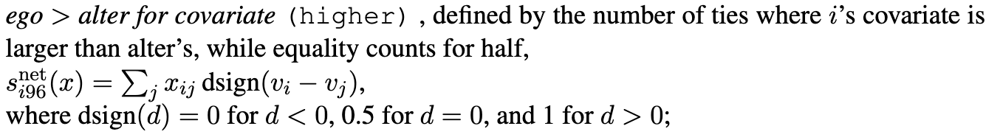

```{r setup, include=FALSE}
knitr::opts_chunk$set(echo = TRUE)
```

### Functions

These functions are empty again (9 Oct)! Tried running it in an .r file but it was still "empty"/just a save of the command rather than making an actual function.

```{r, eval=FALSE}

library(tidyverse)
library(scholar) 
library(openalexR)
library(rvest) 
library(jsonlite)
library(RSiena)

 fpackage.check <- function(packages) {
  lapply(packages, FUN = function(x) {
       if (!require(x, character.only = TRUE)) {
           install.packages(x, dependencies = TRUE)
           library(x, character.only = TRUE)
       }
   })
 }

fsave <- function(x, file = NULL, location = "./data/processed/") {
    ifelse(!dir.exists("data"), dir.create("data"), FALSE)
    ifelse(!dir.exists("data/processed"), dir.create("data/processed"), FALSE)
    if (is.null(file))
        file = deparse(substitute(x))
    datename <- substr(gsub("[:-]", "", Sys.time()), 1, 8)
    totalname <- paste(location, datename, file, ".rda", sep = "")
    save(x, file = totalname)  #need to fix if file is reloaded as input name, not as x. 
}

fload <- function(filename) {
    load(filename)
    get(ls()[ls() != "filename"])
}

fshowdf <- function(x, ...) {
    knitr::kable(x, digits = 2, "html", ...) %>%
        kableExtra::kable_styling(bootstrap_options = c("striped", "hover")) %>%
        kableExtra::scroll_box(width = "100%", height = "300px")
}

colorize <- function(x, color) {
    sprintf("<span style='color: %s;'>%s</span>", color, x)
}

```

```{r eval=FALSE, include=FALSE}

packages = c("RSiena", "devtools", "igraph")
# fpackage.check(packages)
#devtools::install_github('JochemTolsma/RsienaTwoStep', build_vignettes=TRUE)

packages = c("RsienaTwoStep")

# install.packages("RsienaTwoStep")


fpackage.check(packages)

``` 

### Exercise in class

```{r eval=FALSE}
set.seed(24553253)
ego <- ts_select(net = ts_net1)
ego

```

When trying at home, s501 was not found. 

```{r, eval=FALSE}

#?s501

s501
s502

# put the nets in an array
nets <- array(data = c(s501, s502), dim = c(dim(s501), 2))

# dependent
net <- sienaDependent(nets)

```
### Independent variable

```{r, eval=FALSE}

alcohol <- s50a[,1]

alcohol <- coCovar(alcohol)
  
```

```{r, eval=FALSE}

mydata <- sienaDataCreate(net, alcohol)

```

## Step 2: effects

```{r, eval=FALSE}

myeff <- getEffects(mydata)


```

## Step 3: look at the initial data

```{r, eval=FALSE}

print01report(mydata)

```

## Step 4: add effects

```{r, eval=FALSE}

myeff <- includeEffects(myeff, isolateNet, inPop, outAct)  #we know that quite a lot of staff has not published with someone else

```
## Step 5: estimation
```{r, eval=FALSE}
myAlgorithm <- sienaAlgorithmCreate(projname = "soc_init")
ansM1 <- siena07(myAlgorithm, data = mydata, effects = myeff, returnDeps = TRUE)
# if necessary estimate again!  ansM1 <- siena07(myAlgorithm, data = mydata, effects = myeff,
# prevAns = ansM1, returnDeps=TRUE)
ansM1
```


```{r, eval=FALSE, echo=FALSE}
fsave(ansM1)
```

```{r, echo=FALSE}
ansM1 <- fload("./data/processed/20251010ansM1.rda")
ansM1
```


```{r, eval=FALSE}

scholars <- fload("./data/processed/scholars_20240924.rda")

demographics <- do.call(rbind.data.frame, scholars$demographics)

sample <- which(demographics$discipline.22 == "sociology" | demographics$discipline.24 == "sociology")

demographics_soc <- demographics[sample,]
sociologists <- lapply(scholars, "[",sample)
```

```{r, eval=FALSE}
fcolnet <- function(data = scholars, university = "RU", discipline = "sociology", waves = list(c(2015,
    2018), c(2019, 2023)), type = c("first")) {

    # step 1
    demographics <- do.call(rbind.data.frame, data$demographics)
    demographics <- demographics %>%
        mutate(Universiteit1.22 = replace(Universiteit1.22, is.na(Universiteit1.22), ""), Universiteit2.22 = replace(Universiteit2.22,
            is.na(Universiteit2.22), ""), Universiteit1.24 = replace(Universiteit1.24, is.na(Universiteit1.24),
            ""), Universiteit2.24 = replace(Universiteit2.24, is.na(Universiteit2.24), ""), discipline.22 = replace(discipline.22,
            is.na(discipline.22), ""), discipline.24 = replace(discipline.24, is.na(discipline.24), ""))

    sample <- which((demographics$Universiteit1.22 %in% university | demographics$Universiteit2.22 %in%
        university | demographics$Universiteit1.24 %in% university | demographics$Universiteit2.24 %in%
        university) & (demographics$discipline.22 %in% discipline | demographics$discipline.24 %in% discipline))

    demographics_soc <- demographics[sample, ]
    scholars_sel <- lapply(scholars, "[", sample)

    # step 2
    ids <- demographics_soc$au_id
    nwaves <- length(waves)
    nets <- array(0, dim = c(nwaves, length(ids), length(ids)), dimnames = list(wave = 1:nwaves, ids,
        ids))
    dimnames(nets)

    # step 3
    df_works <- tibble(works_id = unlist(lapply(scholars_sel$work, function(l) l$id)), works_author = unlist(lapply(scholars_sel$work,
        function(l) l$author), recursive = FALSE), works_year = unlist(lapply(scholars_sel$work, function(l) l$publication_year),
        recursive = FALSE))

    df_works <- df_works[!duplicated(df_works), ]

    # step 4
    if (type == "first") {
        for (j in 1:nwaves) {
            df_works_w <- df_works[df_works$works_year >= waves[[j]][1] & df_works$works_year <= waves[[j]][2],
                ]
            for (i in 1:nrow(df_works_w)) {
                ego <- df_works_w$works_author[i][[1]]$au_id[1]
                alters <- df_works_w$works_author[i][[1]]$au_id[-1]
                if (sum(ids %in% ego) > 0 & sum(ids %in% alters) > 0) {
                  nets[j, which(ids %in% ego), which(ids %in% alters)] <- 1
                }
            }
        }
    }

    if (type == "last") {
        for (j in 1:nwaves) {
            df_works_w <- df_works[df_works$works_year >= waves[[j]][1] & df_works$works_year <= waves[[j]][2],
                ]
            for (i in 1:nrow(df_works_w)) {
                ego <- rev(df_works_w$works_author[i][[1]]$au_id)[1]
                alters <- rev(df_works_w$works_author[i][[1]]$au_id)[-1]
                if (sum(ids %in% ego) > 0 & sum(ids %in% alters) > 0) {
                  nets[j, which(ids %in% ego), which(ids %in% alters)] <- 1
                }
            }
        }
    }

    if (type == "all") {
        for (j in 1:nwaves) {
            df_works_w <- df_works[df_works$works_year >= waves[[j]][1] & df_works$works_year <= waves[[j]][2],
                ]
            for (i in 1:nrow(df_works_w)) {
                egos <- df_works_w$works_author[i][[1]]$au_id
                if (sum(ids %in% egos) > 0) {
                  nets[j, which(ids %in% egos), which(ids %in% egos)] <- 1
                }
            }
        }
    }
    output <- list()
    output$data <- scholars_sel
    output$nets <- nets
    return(output)
}

```

### works

```{r, eval=FALSE}
demographics_soc <- demographics[sample,]

ids <- demographics_soc$au_id
wave2 <- wave1 <- matrix(0, nrow = length(ids), ncol = length(ids), dimnames = list(ids, ids))

worksobject <- sociologists$works

works_id <- unlist(lapply(worksobject, function(l) l$id))
works_author <- unlist(lapply(worksobject, function(l) l$author), recursive = FALSE)
works_year <- unlist(lapply(worksobject, function(l) l$publication_year), recursive = FALSE)
```

```{r, eval=FALSE}
fcolnet_nouni <- function(data = scholars, discipline = "sociology", waves = list(c(2015,2018), c(2019, 2023)), type = c("first")) {
  
  # step 1
  demographics <- do.call(rbind.data.frame, data$demographics)
  demographics <- demographics %>%
    mutate(Universiteit1.22 = replace(Universiteit1.22, is.na(Universiteit1.22), ""), Universiteit2.22 = replace(Universiteit2.22,
                                                                                                                 is.na(Universiteit2.22), ""), Universiteit1.24 = replace(Universiteit1.24, is.na(Universiteit1.24),
                                                                                                                                                                          ""), Universiteit2.24 = replace(Universiteit2.24, is.na(Universiteit2.24), ""), discipline.22 = replace(discipline.22,
                                                                                                                                                                                                                                                                                  is.na(discipline.22), ""), discipline.24 = replace(discipline.24, is.na(discipline.24), ""))
  
  sample <- which(demographics$discipline.22 %in% discipline | demographics$discipline.24 %in% discipline)
  
  demographics_soc <- demographics[sample, ]
  scholars_sel <- lapply(scholars, "[", sample)
  
  # step 2
  ids <- demographics_soc$au_id
  nwaves <- length(waves)
  nets <- array(0, dim = c(nwaves, length(ids), length(ids)), dimnames = list(wave = 1:nwaves, ids,
                                                                              ids))
  dimnames(nets)
  
  # step 3
  df_works <- tibble(works_id = unlist(lapply(scholars_sel$work, function(l) l$id)), works_author = unlist(lapply(scholars_sel$work,
                                                                                                                  function(l) l$author), recursive = FALSE), works_year = unlist(lapply(scholars_sel$work, function(l) l$publication_year),
                                                                                                                                                                                 recursive = FALSE))
  
  df_works <- df_works[!duplicated(df_works), ]
  
  # step 4
  if (type == "first") {
    for (j in 1:nwaves) {
      df_works_w <- df_works[df_works$works_year >= waves[[j]][1] & df_works$works_year <= waves[[j]][2],
      ]
      for (i in 1:nrow(df_works_w)) {
        ego <- df_works_w$works_author[i][[1]]$au_id[1]
        alters <- df_works_w$works_author[i][[1]]$au_id[-1]
        if (sum(ids %in% ego) > 0 & sum(ids %in% alters) > 0) {
          nets[j, which(ids %in% ego), which(ids %in% alters)] <- 1
        }
      }
    }
  }
  
  if (type == "last") {
    for (j in 1:nwaves) {
      df_works_w <- df_works[df_works$works_year >= waves[[j]][1] & df_works$works_year <= waves[[j]][2],
      ]
      for (i in 1:nrow(df_works_w)) {
        ego <- rev(df_works_w$works_author[i][[1]]$au_id)[1]
        alters <- rev(df_works_w$works_author[i][[1]]$au_id)[-1]
        if (sum(ids %in% ego) > 0 & sum(ids %in% alters) > 0) {
          nets[j, which(ids %in% ego), which(ids %in% alters)] <- 1
        }
      }
    }
  }
  
  if (type == "all") {
    for (j in 1:nwaves) {
      df_works_w <- df_works[df_works$works_year >= waves[[j]][1] & df_works$works_year <= waves[[j]][2],
      ]
      for (i in 1:nrow(df_works_w)) {
        egos <- df_works_w$works_author[i][[1]]$au_id
        if (sum(ids %in% egos) > 0) {
          nets[j, which(ids %in% egos), which(ids %in% egos)] <- 1
        }
      }
    }
  }
  output <- list()
  output$data <- scholars_sel
  output$nets <- nets
  return(output)
}


```


# In class exercise

```{r, eval=FALSE}

test_all <- fcolnet_nouni(data = scholars, 
                    discipline = "sociology",
                    waves = list(c(2015, 2018), c(2019, 2023)), 
                    type = c("first"))

test_RU <- fcolnet(data = scholars, 
                    university = "RU",
                    discipline = "sociology", 
                    waves = list(c(2015, 2018), c(2019, 2023)), 
                    type = c("first"))

test_UvT <- fcolnet(data = scholars, 
                    university = "UvT",
                    discipline = "sociology", 
                    waves = list(c(2015, 2018), c(2019, 2023)), 
                    type = c("first"))


wave1RU <- test_RU$nets[1,,]
wave2RU <- test_RU$nets[2,,]


df <- test_RU$data

#same complicated structure as 'scholars' thus first make a dataframe from the list in which all info was saved. 
df_ego <- do.call(rbind.data.frame, df$demographics)

RUnet <- as.matrix(test_RU$nets[2,,], names=null)

array_RU <- array(data = c(wave1RU, wave2RU), dim = c(dim(wave1RU), 2))
# net_RU <- sienaDependent(array_RU)

#variables

df <- test_RU$data
df_ego <- do.call(rbind.data.frame, df$demographics)


#replacing missing values
df_ego$Functie.22[is.na(df_ego$Functie.22)] <- ""
df_ego$Functie.24[is.na(df_ego$Functie.24)] <- ""


df_ego$functie<-ifelse(df_ego$Functie.22=="Hoogleraar",1,0)
df_ego$functie<-ifelse(df_ego$Functie.24=="Hoogleraar",1,df_ego$functie)


table(df_ego$functie, useNA="always")
functie <- coCovar(df_ego$functie)

# RUtestdata <- sienaDataCreate(net_RU, functie)
# RUtesteff <- getEffects(RUtestdata)


# RUtesteff

```
```{r, eval=FALSE}
ifelse(!dir.exists("results"), dir.create("results"), FALSE)
```

## step 4: results

```{r eval=FALSE}
myeff <- includeEffects(myeff, isolateNet, inPop, outAct)

```


## step 5: estimation

```{r, eval=FALSE}

myAlgorithm <- sienaAlgorithmCreate(projname = "soc_init")
ansM1 <- siena07(myAlgorithm, data = mydata, effects = myeff, returnDeps = TRUE) # big output
ansM1

```

```{r, eval=FALSE, echo=FALSE}
fsave(ansM1)
```

```{r, echo=FALSE}
ansM1 <- fload("./data/processed/20251010ansM1.rda")
ansM1
```

# Continuing with my own project

## getting journal quality

```{r, eval=FALSE}
data = sociologists$works[[1]]

q1_journals = c('Annual Review of Sociology')

number_of_q1_articles = function(data, q1_journals = c("Nature")) {
  n_q1 = sum(data$so[!is.na(data$so)] %in% q1_journals)
  return(n_q1)
}

number_of_q1_articles(sociologists$works[[55]])

# do.call(number_of_q1_articles, sociologists$works)

```

### Loading the journal dataset

```{r, eval=FALSE}

sjr2022 <- read_csv2('/Users/ghislaine/Downloads/Github/Social Networks/scimagojr 2022 Subject Category - Sociology and Political Science.csv')

sjr2024 <- read_csv2('/Users/ghislaine/Downloads/Github/Social Networks/scimagojr 2024 Subject Category - Sociology and Political Science.csv')

```

# Stealing niels vullings' code and linking the journals from SJR to the journals in the dataset

df_works doesn't work yet, I copy pasted it 

```{r, eval=FALSE}

# df_works_dataframe <- do.call(rbind.data.frame, sociologists$works)  # put works in dataframe
# head(df_works)

# Error in (function (..., deparse.level = 1, make.row.names = TRUE, stringsAsFactors = FALSE,  : numbers of columns of arguments do not match

df_works_5 <- tibble(works_id, works_author, works_year)

# test1 <- df_works %>% select(id, so, issn_l, author) # test the works
```

I also copied this code below to lab 6, which *should* work.

```{r, eval=FALSE}

# Split the ISSN codes if 2 are available

sjr2022$Issn_1 <- sapply(strsplit(sjr2022$Issn, ", "), `[`, 1)  # This code should work as a way to split the two issn codes
sjr2022$Issn_2 <- sapply(strsplit(sjr2022$Issn, ", "), `[`, 2)

sjr2024$Issn_1 <- sapply(strsplit(sjr2024$Issn, ", "), `[`, 1)  # This code should work as a way to split the two issn codes
sjr2024$Issn_2 <- sapply(strsplit(sjr2024$Issn, ", "), `[`, 2)

# dat$Issn_1[1] str_length(dat$Issn_1[1])

sjr2022$Issn_1 <- paste0(substr(sjr2022$Issn_1, 1, 4), "-", substr(sjr2022$Issn_1, 5, 8))  # Hyphenate the codes to match the target df 
sjr2022$Issn_2 <- ifelse(is.na(sjr2022$Issn_2) == TRUE, NA, paste0(substr(sjr2022$Issn_2, 1, 4), "-", substr(sjr2022$Issn_2,
    5, 8)))  # Hyphenate the codes, but make non-existing second codes NA

sjr2024$Issn_1 <- paste0(substr(sjr2024$Issn_1, 1, 4), "-", substr(sjr2024$Issn_1, 5, 8))  # Hyphenate the codes to match the target df 
sjr2024$Issn_2 <- ifelse(is.na(sjr2024$Issn_2) == TRUE, NA, paste0(substr(sjr2024$Issn_2, 1, 4), "-", substr(sjr2024$Issn_2,
    5, 8)))  # Hyphenate the codes, but make non-existing second codes NA


df_pres_22 <- sjr2022 %>%
    select(Rank, Title, Issn_1, Issn_2, SJR, `SJR Quartile`, `H index`, `%Female`)  # Make a set that will be joined with df_works

df_pres_24 <- sjr2024 %>%
    select(Rank, Title, Issn_1, Issn_2, SJR, `SJR Quartile`, `H index`, `%Female`)  # Make a set that will be joined with df_works

df_pres_22

# df_works_5 %>% select(issn_l) df_pres %>% select(Issn_1, Issn_2)

# df_works_5$check <- ifelse(df_works_5$issn_l %in% df_pres_22$Issn_1 | df_works_5$issn_l %in% df_pres_22$Issn_2, 1,0)

# mis_journal <- df_works_5 %>%
#   filter(check == 0)

# as.data.frame(unique(mis_journal$so))

```


### first try linking works, bad attempt 

```{r, eval=FALSE}

number_q1_articles = function(data, q1_journals = c("Annual Review of Sociology")) {
  n_q1 = sum(data$so[!is.na(data$so)] %in% q1_journals)
  return(n_q1)
}

# number_q1_articles(sociologists$works[[55]])

```


### Statistics in RSiena

The statistic I chose to present is called "higher". 




$$ \Sigma_j x_{ij}$$ 

For my own purposes, I want to reverse the code, because I want to see whether the alter has a larger covariate than *i*. Within my theoretical framework, this means that ego wants to make a tie with alter because alter has more prestige than ego. 
